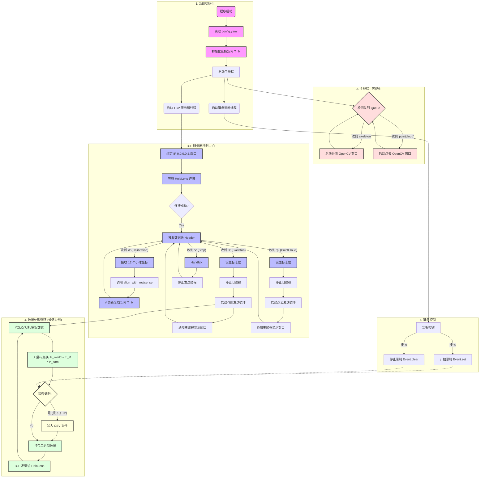

```mermaid
graph TD
    %% 定义样式
    classDef init fill:#f9f,stroke:#333,stroke-width:2px;
    classDef tcp fill:#bbf,stroke:#333,stroke-width:2px;
    classDef process fill:#dfd,stroke:#333,stroke-width:2px;
    classDef visual fill:#fdd,stroke:#333,stroke-width:2px;
    classDef storage fill:#ffd,stroke:#333,stroke-width:2px;

    %% 1. 初始化阶段
    subgraph Init ["1. 系统初始化"]
        Start(程序启动) --> LoadConfig[读取 config.yaml]
        LoadConfig --> InitTM[初始化变换矩阵 T_M]
        InitTM --> StartThreads[启动子线程]
        StartThreads --> TCPThread_Start(启动 TCP 服务器线程)
        StartThreads --> KeyboardThread_Start(启动键盘监听线程)
    end

    %% 2. 主线程可视化
    subgraph Visualization ["2. 主线程 - 可视化"]
        StartThreads --> VisualLoop{检测队列 Queue}
        VisualLoop -- "收到 'skeleton'" --> ShowSkel[启动骨骼 OpenCV 窗口]
        VisualLoop -- "收到 'pointcloud'" --> ShowPC[启动点云 OpenCV 窗口]
        ShowSkel --> VisualLoop
        ShowPC --> VisualLoop
    end
    
    %% 3. TCP 服务器逻辑
    subgraph TCPServer ["3. TCP 服务器控制中心"]
        TCPThread_Start --> Bind[绑定 IP 0.0.0.0 & 端口]
        Bind --> Listen[等待 HoloLens 连接]
        Listen --> Connected{连接成功?}
        Connected -- Yes --> RecvLoop[接收数据头 Header]
        
        RecvLoop -- "收到 'd' (Calibration)" --> HandleD
        RecvLoop -- "收到 's' (Skeleton)" --> HandleS
        RecvLoop -- "收到 'p' (PointCloud)" --> HandleP
        RecvLoop -- "收到 'x' (Stop)" --> HandleX
        
        %% 处理 D: 校准
        HandleD[接收 12 个小球坐标] --> AlgoAlign[调用 align_with_realsense]
        AlgoAlign --> UpdateTM[⚡ 更新全局矩阵 T_M]
        UpdateTM --> RecvLoop
        
        %% 处理 S: 骨骼
        HandleS[设置标志位] --> StopOld1[停止旧线程]
        StopOld1 --> StartSkelThread[启动骨骼发送循环]
        StartSkelThread --> NotifyVisual1[通知主线程显示窗口]
        NotifyVisual1 --> RecvLoop

        %% 处理 P: 点云
        HandleP[设置标志位] --> StopOld2[停止旧线程]
        StopOld2 --> StartPCThread[启动点云发送循环]
        StartPCThread --> NotifyVisual2[通知主线程显示窗口]
        NotifyVisual2 --> RecvLoop
        
        %% 处理 X: 停止
        HandleX --> StopAll[停止发送线程]
        StopAll --> RecvLoop
    end

    %% 4. 数据处理循环
    subgraph DataProcess ["4. 数据处理循环 (骨骼为例)"]
        StartSkelThread --> Capture[YOLO/相机 捕捉数据]
        Capture --> Transform[⚡ 坐标变换: P_world = T_M * P_cam]
        Transform --> CheckSave{是否录制?}
        
        %% 录制分支
        CheckSave -- "是 (按下了 'a')" --> WriteCSV[写入 CSV 文件]
        WriteCSV --> PackData
        CheckSave -- "否" --> PackData
        
        PackData[打包二进制数据] --> SendTCP[TCP 发送给 HoloLens]
        SendTCP --> Capture
    end

    %% 5. 键盘控制
    subgraph Keyboard ["5. 键盘控制"]
        KeyboardThread_Start --> ListenKey[监听按键]
        ListenKey -- "按 'a'" --> SetSave[开始录制 Event.set]
        ListenKey -- "按 's'" --> ClearSave[停止录制 Event.clear]
        SetSave -.-> CheckSave
        ClearSave -.-> CheckSave
    end

    %% 样式应用
    class Start,LoadConfig,InitTM init;
    class Bind,Listen,RecvLoop,HandleD,HandleS,HandleP,HandleX,UpdateTM tcp;
    class Capture,Transform,PackData,SendTCP process;
    class VisualLoop,ShowSkel,ShowPC visual;
    class WriteCSV,CheckSave storage;
```
